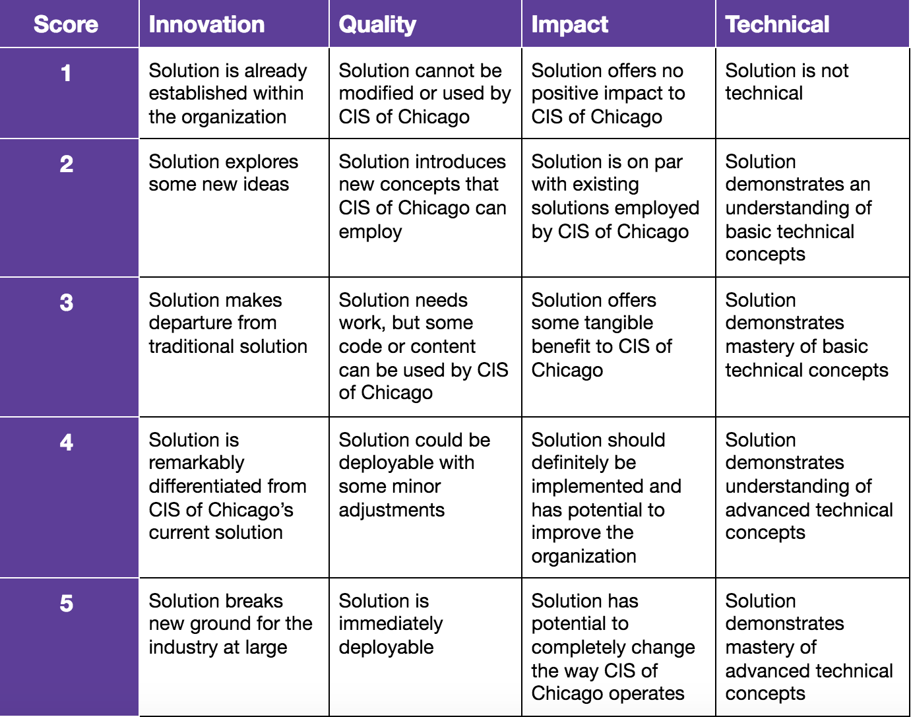

# NUDM Tech Challenge
presented by

Guidelines and data for the Northwestern University Dance Marathon Tech Challenge, in partnership with Bounteous

The NUDM Tech Challenge is a 2 week long hack-a-thon where students aim to solve 1 of our 3 problem statements. Students maybe compete in teams of up to 3 people. One winning team will be chosen and $2000 will be allocated to the NUDM team fundraising pages of their choice.

Kickoff: Monday 1/21/18 5pm-6pm

Bounteous Office Hours: Monday 1/28/18 5pm-8pm

Final Presentations: Friday 2/1/18 12pm-2pm

# Problem Statements:

1. Due to new regulations in the nonprofit industry CIS of Chicago’s employees must track their hours accurately. Develop a solution to address this.

2. CIS of Chicago chooses which CPS schools to partner with based on their level of need. Develop a way for them to better consider a multitude of factors and ultimately make this decision.

3. CIS of Chicago is always looking for better ways to improve graduation rates in CPS schools. Develop your own prompt and answer it!

Participants are free to pursue solutions in whatever format they wish! Ideas and resources for getting started are provided below.

# Rubric:

# CIS of Chicago 

https://www.cisofchicago.org/

Communities In Schools (CIS) of Chicago works to lower dropout rates in Chicago Public Schools. (CPS) Their programs work on 4 key areas:

1. Arts
2. College and Career Preparation
3. Health
4. Mental Health and Wellness

For more on how CIS operates within schools:

https://www.cisofchicago.org/big-ideas/

https://www.cisofchicago.org/key-programs/

# Data Resources:

There are two types of data relevant to CPS schools: School specific data and data on the surrounding neighborhood. School data will tell you about the performance of the school via test scores and other performance metrics. Neighborhood data will tell you about the area that the school is located in. This is relevant because schools largely draw from their surrounding neighborhoods.

Within **CPS Schools sheet** we have listed every CPS school, its associated school id, neighborhood, affiliation with CIS of Chicago in addition to other general info. This sheet was designed as a starting point
for aggregating the data that you wish to collect.

**Prepared "Neighborhood Data":**

We collected data from the Chicago Health Atlas 1.0 API (https://chicagohealth.herokuapp.com/apidoc/1.0.html) and put it into csv files. The data in this folder represents a subset of the total data in the Atlas, so if you would like more detail you should use the API. What we do have is segmented by neighborhood under the column 'location' so it can be joined to the CPS School sheet with a simple vlookup or index/match function.

The data is organized into categories. (demography, clinical-care, etc.) Within these categories we list indicators (columns) by the different metrics (percent, crude_rate, number, ave_annual_number) used to record them. Some metrics are not applicable for certain indicators, so not all of the data is filled in. 

Percent - cases per 100

Crude Rate - cases per 100,000

Number - cases

Ave Annual Number - average number of annual cases

The data recorded has associated dates and descriptions which are detailed in the indicator_info.csv

**School Specific Data (join to CPS Schools sheet based on School ID):**

https://www.cps.edu/SchoolData/Pages/SchoolData.aspx (Summarized in "Summary CPS Data.pdf")

http://guides.lib.uchicago.edu/education/statistics

**Other Neighborhood Specific Data (join to CPS Schools sheet based on Neighborhood):**

https://data.cityofchicago.org/

# Mobile App Developer Resources:

Getting started in React Native - https://expo.io/tools

Getting started in Ionic - https://ionicframework.com/

# Other Resources

Tableau for students - https://www.tableau.com/academic/students

Microsoft Office for students - https://msoffice.northwestern.edu

Postman (for API testing) - https://www.getpostman.com/apps

Requests (for API's in Python scripts) - https://www.pythonforbeginners.com/requests/using-requests-in-python

