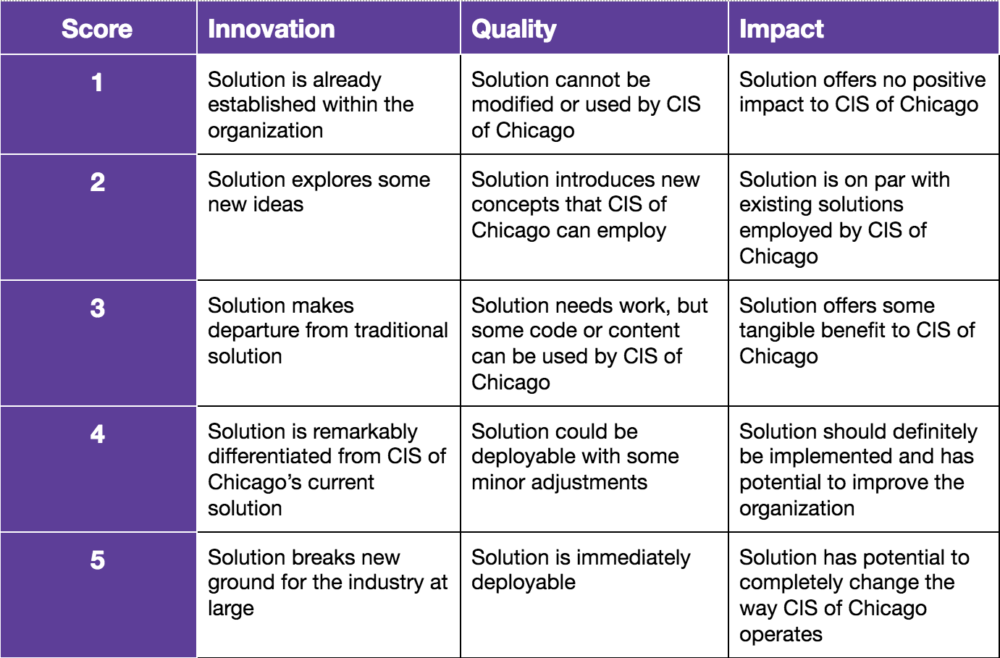

# NUDM_Tech_Challenge
Guidelines and data for the NUDM Tech Challenge, in partnership with Bounteous

The NUDM Tech Challenge is a 2 week long hack-a-thon where students aim to solve 1 of our 3 problem statements. One winner will be chosen and 2000 will be allocated to the NUDM fundraising page of their choice.

Kickoff: Monday 1/21/18
Bounteous Office Hours: Monday 1/28/18
Final Presentations: Friday 2/1/18

Problem Statements:

1. Due to new regulations in the nonprofit industry CIS of Chicago’s employees must track their hours accurately. Develop a solution to address this.

2. CIS of Chicago chooses which CPS schools to partner with based on their level of need. Develop a way for them to better consider a multitude of factors and ultimately make this decision.

3. CIS of Chicago is always looking for better ways to improve graduation rates in CPS schools. Develop your own prompt and answer it!

Rubric:

Resources:

